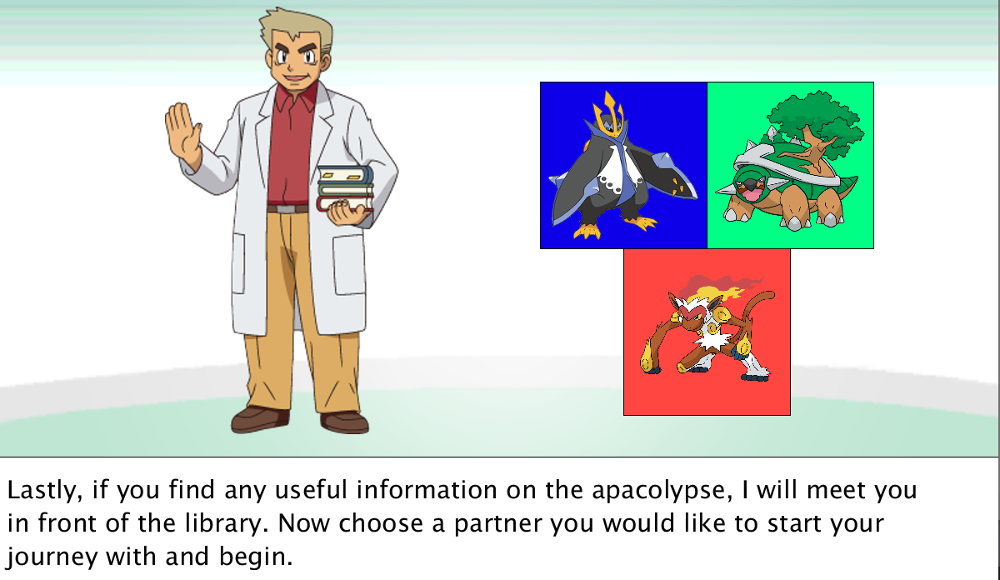
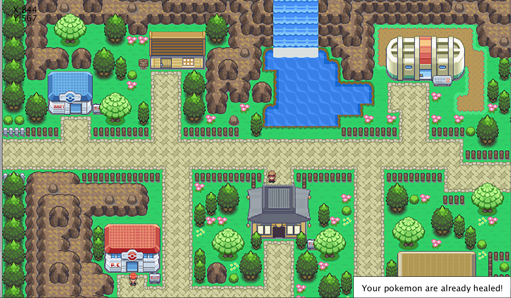
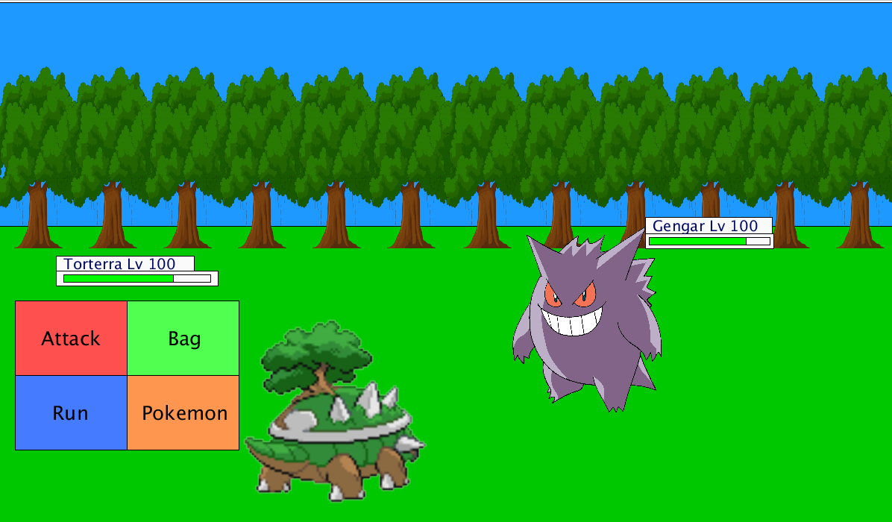
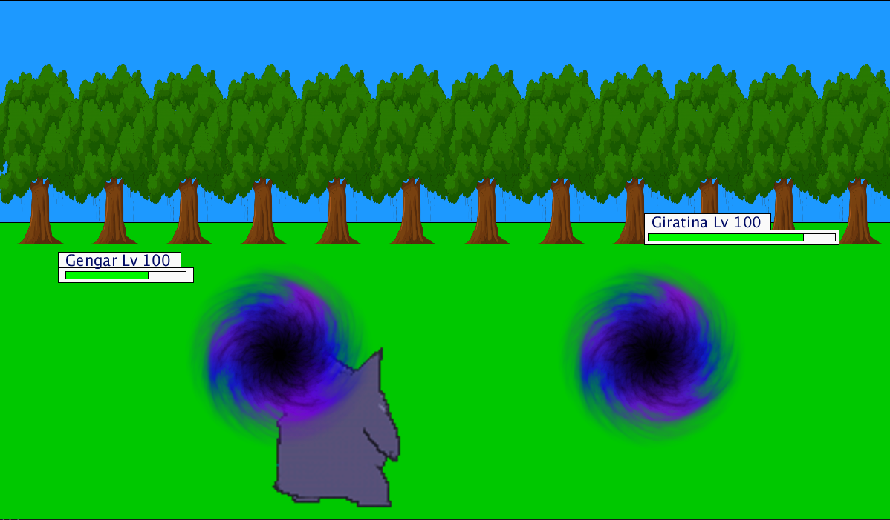

# Pokemon Recreation
Recreated Pokemon-like game using object-oriented programming in Java and open-source animation IDE Processing

## Installing
* Requires Processing version 3.5.4 or higher
* Install libraries Minim and controlP5
```
import ddf.minim.*;
Minim minim;
import controlP5.*;
ControlP5 cp5;
```

## Screenshots
Start with a tutorial on the controls and plot of the game, and choose your starter pokemon. 


Move around the map with arrowkeys, enter buildings and stand in the grass to challenge pokemon. 


Enter battle and choose between fighting, running, switching your pokemon or capturing the pokemon. 


Play as the pokemon you capture with different animations for each move! 

